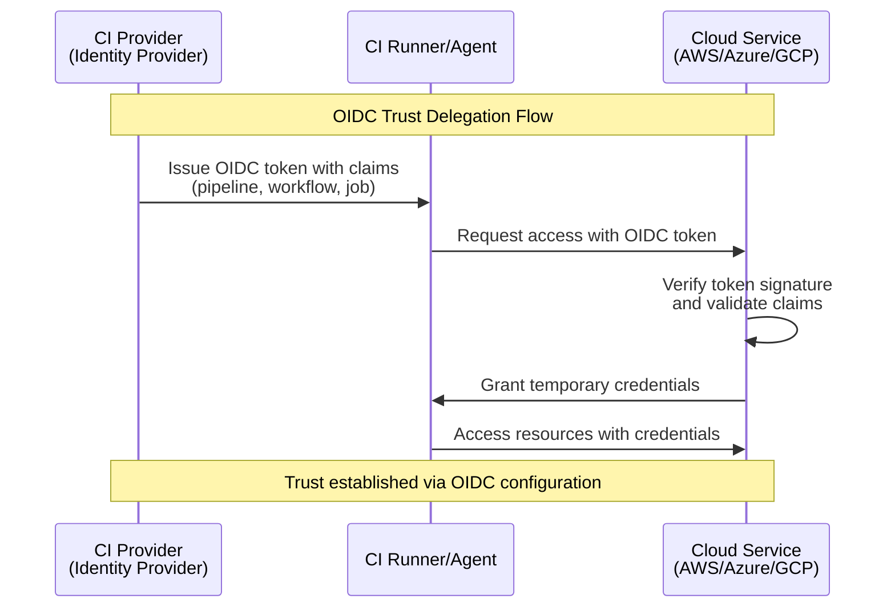

+++
title = "Why OIDC?"
date = "2025-11-16T08:55:22+10:00"
tags = [ "oidc", "authentication", "security", "software development", "developer tools", "api security"]
+++

Over the last few years there has been a push away from using machine identity for continuous integration (CI) agents, or runners, and instead use a more targetted, least privileged approach to authentication and authorization. This is where OIDC (OpenID Connect) comes in, which is a method of authentication used to bridge between the CI provider and cloud services such as AWS, Azure, and Google Cloud.

In this model the CI provider acts as an identity provider, issuing tokens to the CI runner/agent which include a set of claims identifying the owner, pipeline, workflow and job that is being executed. This is then used to authenticate to the cloud service, and access the resources that the pipeline, workflow and job require.

In simple terms this is a form of trust delegation, where the CI provider is trusted by the cloud service to issue tokens on behalf of the owner, pipeline, workflow and job. 

The reasons this is useful are:

- It provides a more secure and flexible approach to authentication and authorization
- It limits the scope of the token to the specific pipeline, workflow, and job
- It is tied to the lifecycle of the pipeline, workflow, and job, which means the lifetime of tokens is limited to the duration of the pipeline, workflow, and job
- It is more flexible than using machine identity for CI agents/runner as it allows for more granular control over the permissions granted to the runner/agent

This is particularly useful when paired with ephemerimal runners/agents, as it allows for the runner/agent to be deleted after the pipeline, workflow, and job have completed, reducing the attack surface of the CI environment.

I think the biggest advantage of this approach is that it allows engineers to focus on the access required by the pipeline, workflow, and job, rather than having to manage machine identities and permissions for each runner/agent.
