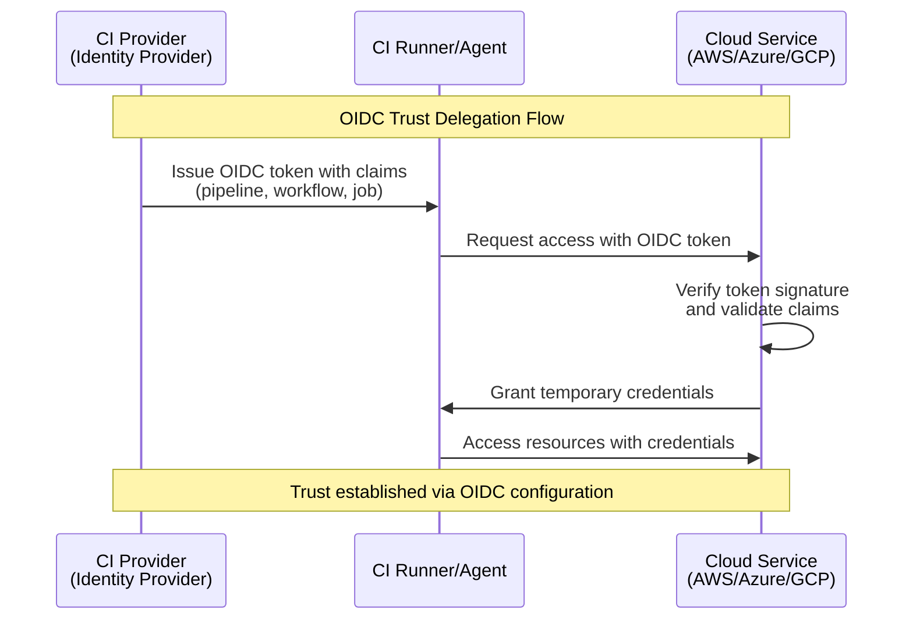

+++
title = "Why OIDC?"
date = "2025-11-16T08:55:22+10:00"
tags = [ "oidc", "authentication", "security", "software development", "developer tools", "api security"]
+++

Over the last few years there has been a push away from using machine identity for continuous integration (CI) agents, or runners, and instead use a more targeted, least privileged approach to authentication and authorization. This is where [OIDC (OpenID Connect)](https://openid.net/developers/how-connect-works/) comes in, which is a method of authentication used to bridge between the CI provider and cloud services such as AWS, Azure, and Google Cloud.

In this model the CI provider acts as an identity provider, issuing tokens to the CI runner/agent which include a set of claims identifying the owner, pipeline, workflow and job that is being executed. This is then used to authenticate to the cloud service, and access the resources that the pipeline, workflow and job require.

In simple terms this is a form of trust delegation, where the CI provider is trusted by the cloud service to issue tokens on behalf of the owner, pipeline, workflow and job. 

## How OIDC Works

The OIDC trust delegation flow is as follows:

There are a few things to note:

* When using OIDC, the runner doesn't need to be registered with the cloud service, it is provided access by the CI provider.
* The OIDC token is cryptographically signed by the CI provider, and the cloud service verifies the signature to ensure the token is valid.
* In this model all three parties (CI provider, runner, and cloud service) are trusted to issue and verify tokens.

## How to limit cloud access to the agent/runner?

To ensure the CI provider can't access the cloud service directly, you can add conditions which ensure only the runner/agent is allowed to access the cloud resources.

On top of this cloud providers such as AWS have conditions which can [restrict access to a specific AWS network resource, such as a VPC](https://docs.aws.amazon.com/IAM/latest/UserGuide/reference_policies_condition-keys.html#condition-keys-network-properties). I recommend familiarizing yourself with the documentation for your cloud provider to understand how to lock down access to the runner/agent.

## Benefits of OIDC

The reasons this is useful are:

- It provides a more secure and flexible approach to authentication and authorization
- It limits the scope of the token to the specific pipeline, workflow, and job
- It is tied to the lifecycle of the pipeline, workflow, and job, which means the tokens is limited to the duration of the execution
- It is more flexible than using machine identity for CI agents/runner as it allows for more granular control over the permissions granted to the runner/agent

## ephemeral runners/agents

Ephemeral runners/agents are short lived, single job, or single workflow runners/agents which are created before the workflow, or job is started. They provide a more secure and flexible approach to job execution as there is no need to worry about these environments being tainted by previous jobs or workflows.

When paired with OIDC these environments provide an extra layer of security as they are destroyed after the job or workflow is complete, further reducing the risk of cross job or workflow access.

## Summary

So in summary, OIDC provides a more secure and flexible approach to access management for CI projects, and it is particularly useful when paired with ephemeral runners/agents.

The biggest advantage of this approach is that it allows engineers to focus on the access required by the pipeline, workflow, and job, rather than having to manage machine identities and permissions for each runner/agent.

## Links

* [OIDC for Buildkite](https://buildkite.com/docs/pipelines/security/oidc)
* [OIDC for GitHub Actions](https://docs.github.com/en/enterprise-cloud@latest/actions/concepts/security/openid-connect)
* [OIDC for GitLab](https://docs.gitlab.com/integration/openid_connect_provider/)
